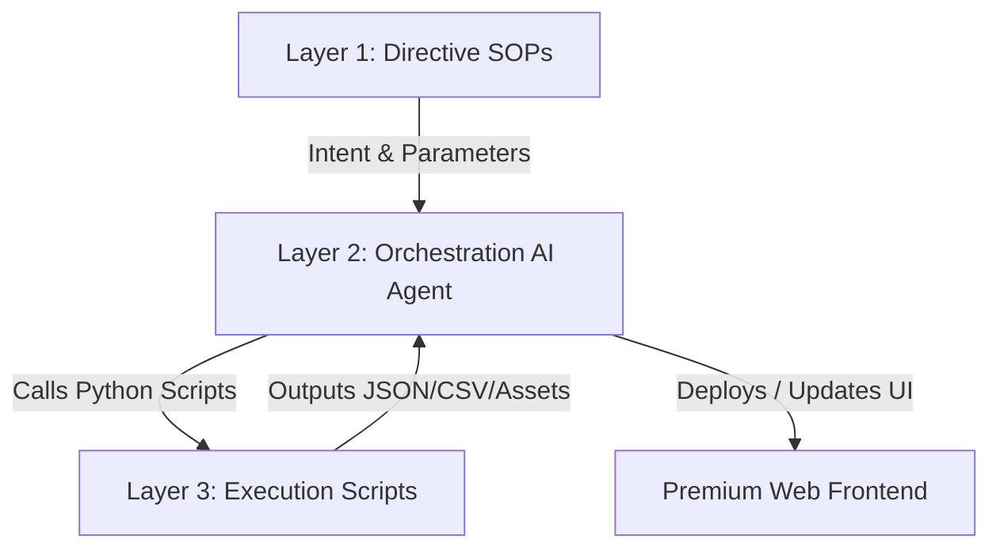

# 🍫 Feastables Premium Sales Dashboard

A highly polished, premium glassmorphic sales dashboard designed specifically around the **Feastables** brand aesthetic to track sales metrics, product performances, and conversion trends of Feastables chocolates. 

This repository is built following a strict **3-Layer Architecture** to separate declarative logic (directives) from deterministic action (execution), ensuring high reliability, consistency, and clean code organization.

---

## 🚀 Key Features

*   **Ultra-Premium Glassmorphic UI**: Translucent panels with a frosted glass blur (`backdrop-filter`), vibrant glowing drop shadows, sleek animated ambient background orbs in Feastables brand colors, and high-energy accent styling.
*   **Kanit Typography**: A clean, modern sans-serif corporate SaaS aesthetic using imported Kanit fonts with optimized letter-spacing.
*   **Interactive Visualizations**: 
    *   **Revenue Trend Line Chart**: Features smooth Bezier curves and a custom Chart.js glow plugin creating a neon-neon glow effect.
    *   **Sales by Product Doughnut Chart**: Elegant donut visualization detailing product shares.
*   **Fully Tabbed Interface**: Responsive client-side navigation allowing seamless switching between *Dashboard*, *Products*, *Sales & Analytics*, *Customers*, and *Settings*.
*   **Data Portability (CSV Export)**: An integrated client-side data exporter that compiles the sales metrics and outputs a cleanly formatted CSV download (`feastables_sales_data.csv`) immediately.
*   **Mock Product Data Set**: Includes realistic sales, stock statuses, revenue, and product image integrations for Feastables favorites:
    *   *Mario Galaxy Cocoa Crunch*
    *   *Milk Chocolate Bar*
    *   *Deez Nutz Peanut Butter*
    *   *Karl Gummies (Sour Apple)*

---

## 🛠️ Project Architecture (3-Layer Pattern)

The codebase leverages a decoupled 3-Layer Architecture separating concerns into three clear domains:



### 1. Layer 1: Directive (SOPs in Markdown)
*   **Location**: `directives/`
*   **Purpose**: These are Standard Operating Procedures (SOPs) written in natural language. They serve as step-by-step guides for the AI Orchestration layer, specifying the exact tools, scripts, expected parameters, and output formats.
*   **Example**: `directives/extract_brand_guidelines.md`

### 2. Layer 2: Orchestration (Decision Making)
*   **Location**: Managed by the agent workspace configuration.
*   **Purpose**: Handles intelligent routing, reads directives, executes deterministic python scripts in the correct order, manages error handling (self-annealing), and incorporates feedback loop results.

### 3. Layer 3: Execution (Deterministic Action)
*   **Location**: `execution/`
*   **Purpose**: Contains highly reliable, deterministic Python scripts. These scripts perform heavy lifting like API consumption, scraping, and raw data compilation.
*   **Example**: `execution/scrape_brand.py` — uses the Firecrawl API to extract structured brand details and logo URLs, storing them as intermediate assets inside `tmp/brand_data.json`.

---

## 📂 Directory Layout

Here is an overview of the key directories in the repository:

```text
├── brand-guidelines/       # Extracted brand information and design skills
├── brand_data/             # Parsed JSON assets and brand design guides
├── dashboard/              # The frontend application
│   └── index.html          # Core single-page application (HTML5/CSS3/Vanilla JS)
├── directives/             # Layer 1 - SOPs and natural language instructions
│   └── extract_brand_guidelines.md
├── execution/              # Layer 3 - Deterministic Python utility scripts
│   └── scrape_brand.py     # Automated Firecrawl scraping script
├── firecrawl-brand-extracted/
├── tmp/                    # Intermediate generated data and files (ignored by Git)
├── .env                    # System environment configuration keys
├── .gitignore              # Git patterns to ignore (temp directories, venv, .env)
└── README.md               # You are here!
```

---

## 🚦 Getting Started

### 🖥️ 1. Serving the Dashboard
The frontend is built using standard, highly portable HTML5, CSS3, and JavaScript, meaning you can run it easily without complex bundlers.

#### Option A: Using `npx` (Node.js)
If you have Node.js installed, serve the dashboard instantly from the workspace root:
```bash
npx http-server dashboard -p 8000
```
Then, open your browser and navigate to: **`http://localhost:8000`**

#### Option B: Using Python
If you prefer Python, you can spin up the built-in HTTP server:
```bash
python -m http.server 8000 --directory dashboard
```
Then, navigate to: **`http://localhost:8000`**

---

### 🕷️ 2. Running the Brand Guidelines Scraper
To extract structured branding assets, styling guides, or hero images from any target website:

1.  **Configure environment variables**:
    Create a `.env` file in the root directory and add your Firecrawl API key:
    ```env
    FIRECRAWL_API_KEY=fc-xxxxxxxxxxxxxxxxxxxxxxxxxxxxxxxx
    ```

2.  **Activate your virtual environment**:
    ```bash
    # Windows PowerShell
    .venv\Scripts\Activate.ps1
    
    # Windows Command Prompt
    .venv\Scripts\activate.bat
    
    # macOS/Linux
    source .venv/bin/activate
    ```

3.  **Install dependencies**:
    ```bash
    pip install firecrawl-py pydantic
    ```

4.  **Run the execution script**:
    ```bash
    python execution/scrape_brand.py https://feastables.com
    ```
    This script will fetch and parse the website, outputting a structured dataset directly to `tmp/brand_data.json`.

---

## 🎨 Design Theme Specification

If you ever want to adjust the aesthetic parameters, the core styling variables are located in `dashboard/index.html` under the `:root` element:

```css
:root {
    --primary: #72E2FF;              /* Vibrant Cyan */
    --primary-glow: rgba(114, 226, 255, 0.5);
    --secondary: #CEFC17;            /* Neon Yellow-Green */
    --secondary-glow: rgba(206, 252, 23, 0.4);
    --bg-base: #05070A;              /* Ultra-Deep Space Dark */
    --text-primary: #F8FAFC;         /* Off-white */
    --text-muted: #94A3B8;           /* Muted Slate Gray */
}
```

*Enjoy your premium sales tracking experience! 🍫*
